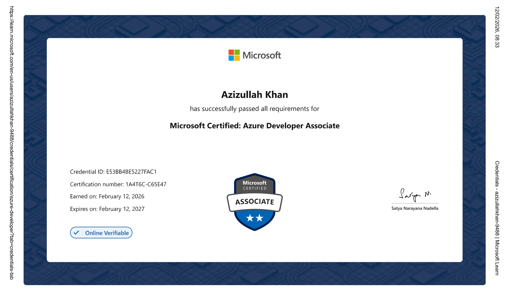

# AZ-204: Developing Solutions for Microsoft Azure — Complete Study Notes

### **I passed the exam using these notes. Now sharing them with the community.**

 

 

> **47,000+ lines of exam-focused notes** · **12 topic modules** · **2,600+ real exam dump questions**  
> Everything you need to pass AZ-204 on your first attempt — for free.

---

## Why These Notes Are Different

Most study guides are either too shallow or too long to revise quickly before the exam. These notes were written to be **both deep and fast to review**:

- **Deep Conceptual Explanations** — every major topic has a "why it works this way" breakdown, not just bullet points
- **Exam-Critical Callouts** — sections tagged `EXAM CRITICAL` highlight what Microsoft actually tests
- **Must-Know Numbers** — limits, thresholds, and numeric values Microsoft loves to test
- **Exam Scenario Banks** — real exam scenarios with recommended answers and reasoning, included in every module
- **Quick-Reference Checklists** — CLI commands, SDK patterns, service comparison tables, and configuration options at a glance
- **Exam Gotchas** — every module ends with the tricky distinctions that trip candidates up most

---

## Table of Contents

- [What's Inside](#whats-inside)
- [Exam Domain Breakdown](#exam-domain-breakdown)
- [Module 1: Azure App Service](#module-1-azure-app-service)
- [Module 2: Azure Functions](#module-2-azure-functions)
- [Module 3: Containerized Solutions](#module-3-containerized-solutions)
- [Module 4: Azure Blob Storage](#module-4-azure-blob-storage)
- [Module 5: Azure Cosmos DB](#module-5-azure-cosmos-db)
- [Module 6: Authentication and Authorization](#module-6-authentication-and-authorization)
- [Module 7: Secure Cloud Solutions](#module-7-secure-cloud-solutions)
- [Module 8: Application Insights](#module-8-application-insights)
- [Module 9: API Management](#module-9-api-management)
- [Module 10: Event-Based Solutions](#module-10-event-based-solutions)
- [Module 11: Message-Based Solutions](#module-11-message-based-solutions)
- [Module 12: Caching, CDN, and Miscellaneous Topics](#module-12-caching-cdn-and-miscellaneous-topics)
- [Practice Questions](#practice-questions)
- [Dump Questions — Real Exam Questions](#dump-questions--real-exam-questions)
- [How to Use These Notes](#how-to-use-these-notes)
- [Exam at a Glance](#exam-at-a-glance)
- [Contributing](#contributing)

---

## What's Inside

| File | Description |
|------|-------------|
| [az204_app_service_notes.md](az204_app_service_notes.md) | App Service plans, deployment slots, scaling, WebJobs, CORS, networking, health checks, custom containers |
| [az204_azure_functions_notes.md](az204_azure_functions_notes.md) | Function triggers and bindings, Durable Functions patterns, access keys, in-process vs isolated worker models |
| [az204_containerized_solutions_notes.md](az204_containerized_solutions_notes.md) | Azure Container Registry, Azure Container Instances, Azure Container Apps, Dockerfile concepts |
| [az204_blob_storage_notes.md](az204_blob_storage_notes.md) | Blob storage tiers, lifecycle management, SDK operations, SAS tokens, encryption, static websites |
| [az204_cosmos_db_notes.md](az204_cosmos_db_notes.md) | Cosmos DB APIs, consistency levels, partitioning, RU/s, change feed, indexing policies, SDK patterns |
| [az204_authentication_authorization_notes.md](az204_authentication_authorization_notes.md) | Microsoft Identity Platform, MSAL, Managed Identities, Key Vault, SAS, Microsoft Graph, JWT tokens |
| [az204_secure_cloud_solutions_notes.md](az204_secure_cloud_solutions_notes.md) | Key Vault secrets and certificates, Managed Identities, Azure App Configuration, secure connection patterns |
| [az204_application_insights_notes.md](az204_application_insights_notes.md) | SDK instrumentation, custom events, metrics, KQL queries, availability tests, OpenTelemetry, alerts |
| [az204_api_management_notes.md](az204_api_management_notes.md) | API Management policies, tiers, subscriptions, backends, caching, versioning, developer portal |
| [az204_event_based_solutions_notes.md](az204_event_based_solutions_notes.md) | Event Grid routing and subscriptions, Event Hubs partitions and consumer groups, service selection criteria |
| [az204_message_based_solutions_notes.md](az204_message_based_solutions_notes.md) | Service Bus queues and topics, Queue Storage, dead-letter queues, sessions, message lock, architecture patterns |
| [az204_misc_topics_notes.md](az204_misc_topics_notes.md) | Azure Cache for Redis, Azure CDN and Front Door, Virtual Machines and Scale Sets basics |
| [az204_practice_questions.md](az204_practice_questions.md) | 230 hand-written practice questions with full explanations covering all exam domains |

---

## Exam Domain Breakdown

The AZ-204 exam tests five functional domains. Here's the official weight and which note file(s) cover it:

| Domain | Weight | Note File(s) |
|--------|--------|--------------|
| Develop Azure compute solutions | **25–30%** | [App Service](az204_app_service_notes.md) · [Functions](az204_azure_functions_notes.md) · [Containers](az204_containerized_solutions_notes.md) |
| Develop for Azure storage | **15–20%** | [Blob Storage](az204_blob_storage_notes.md) · [Cosmos DB](az204_cosmos_db_notes.md) |
| Implement Azure security | **20–25%** | [Authentication](az204_authentication_authorization_notes.md) · [Secure Cloud](az204_secure_cloud_solutions_notes.md) |
| Monitor, troubleshoot, and optimize | **15–20%** | [Application Insights](az204_application_insights_notes.md) · [Misc](az204_misc_topics_notes.md) |
| Connect to and consume Azure services | **15–20%** | [API Management](az204_api_management_notes.md) · [Event-Based](az204_event_based_solutions_notes.md) · [Message-Based](az204_message_based_solutions_notes.md) |

> **Tip**: Compute solutions alone cover 25–30% of the exam. App Service, Functions, and Containers are your highest-ROI modules.

---

## Module 1: Azure App Service

**File:** [az204_app_service_notes.md](az204_app_service_notes.md)

### Topics Covered

- **Learning Path Overview** — how App Service fits the AZ-204 exam domains and what Microsoft actually tests
- **Explore Azure App Service** — App Service plans, compute tiers (Free, Shared, Basic, Standard, Premium, Isolated), always-on, OS choices
- **Configure Web App Settings** — application settings vs connection strings, slot settings vs app settings, environment variables, managed identity in app settings (EXAM CRITICAL)
- **Scale Apps in Azure App Service** — manual vs autoscale, scale-out vs scale-up, metric-based and schedule-based scale rules, cool-down periods
- **Explore Azure App Service Deployment Slots** — slot purpose, slot-sticky settings, traffic percentage routing, swap with preview, warm-up behaviour (EXAM CRITICAL)
- **Custom Containers & Docker Deployment** — multi-container with Docker Compose, custom registry configuration, CI/CD webhooks for container updates
- **WebJobs** — continuous vs triggered WebJobs, supported script types, WebJob vs Azure Functions selection criteria
- **Advanced Deployment Techniques** — deployment sources (GitHub, Bitbucket, local Git, zip deploy), deployment credentials, run-from-package
- **CORS, Health Check, Backup & Restore, Local Cache** — CORS allowed origins, health check path behaviour, backup prerequisites, local cache trade-offs
- **Advanced Networking Deep Dive** — inbound vs outbound traffic controls, VNet integration, private endpoints, access restrictions, hybrid connections
- **Important App Settings, mTLS & Miscellaneous** — `WEBSITE_RUN_FROM_PACKAGE`, `WEBSITES_ENABLE_APP_SERVICE_STORAGE`, mTLS client certificate modes
- **Exam Preparation: Key Topics & Questions** — scenario bank with correct answers and reasoning
- **Exam Gotchas & Tricky Distinctions** — slot swap behaviour, plan tier feature gates, deployment slot warm-up
- **Key CLI Commands Reference** — `az webapp create`, `az webapp deployment slot`, `az webapp config`, ready to paste
- **Quick Reference Summary** — plan tier comparison, slot limits, autoscale rules, deployment methods at a glance

---

## Module 2: Azure Functions

**File:** [az204_azure_functions_notes.md](az204_azure_functions_notes.md)

### Topics Covered

- **Learning Path Overview** — Functions exam weight and what scenarios Microsoft tests most
- **Explore Azure Functions** — hosting plans (Consumption, Premium, Dedicated), cold start behaviour, scaling behaviour per plan (EXAM CRITICAL)
- **Develop Azure Functions** — function.json bindings, input/output bindings, trigger types, supported languages, local development with Core Tools
- **Durable Functions (Advanced)** — orchestrator, activity, and entity functions; fan-out/fan-in, chaining, async HTTP API, monitor, and human interaction patterns (EXAM CRITICAL)
- **Function Access Keys & HTTP Authorization** — function key vs host key vs master key, anonymous vs function vs admin auth levels
- **.NET Execution Models (In-Process vs Isolated Worker)** — programming model differences, migration path, dependency injection, middleware support
- **Advanced Trigger & Binding Configurations** — Blob trigger poll delay vs Event Grid trigger, Timer trigger CRON expressions, Queue trigger batch size and visibility timeout
- **Networking, Security & Identity** — VNet integration, private site access, managed identity with bindings, Key Vault references in function app settings
- **Advanced Deployment & Runtime Configuration** — deployment slots for Functions, `FUNCTIONS_WORKER_RUNTIME`, extension bundles, host.json tuning
- **Additional Azure Functions Concepts** — retry policies, custom handlers, extension versioning, Azure Functions vs Logic Apps vs WebJobs selection
- **Exam Preparation: Key Topics & Questions** — hosting plan selection scenarios, Durable Functions pattern identification
- **Exam Gotchas & Tricky Distinctions** — Consumption vs Premium cold start, trigger vs input vs output binding, orchestrator replay constraints
- **Key CLI Commands Reference** — `az functionapp create`, publish commands, settings management
- **Quick Reference Summary** — hosting plan comparison table, trigger/binding cheat sheet

---

## Module 3: Containerized Solutions

**File:** [az204_containerized_solutions_notes.md](az204_containerized_solutions_notes.md)

### Topics Covered

- **Learning Path Overview** — container services on Azure and how they map to the compute exam domain
- **Azure Container Registry (ACR)** — registry tiers (Basic, Standard, Premium), geo-replication, content trust, admin user vs service principal authentication (EXAM CRITICAL)
- **Azure Container Instances (ACI)** — container groups, resource requests vs limits, restart policies, environment variables, volume mounts, init containers
- **Azure Container Apps** — Dapr integration, KEDA-based scaling, revisions, ingress, environment variables, secrets, managed identities
- **Dockerfile & Container Image Concepts** — multi-stage builds, base image selection, layer caching, .dockerignore, CMD vs ENTRYPOINT
- **ACR Advanced Concepts** — ACR Tasks (quick tasks, auto-triggered tasks), image import, retention policies, webhooks, private link
- **ACI Advanced Concepts** — YAML deployment spec, virtual node integration, GPU containers, confidential containers
- **Container Apps Advanced Concepts** — traffic splitting between revisions, custom scaling rules, Container Apps jobs, service bindings
- **Exam Preparation: Key Topics & Questions** — container service selection criteria, ACR authentication methods
- **Exam Gotchas & Tricky Distinctions** — ACI vs Container Apps vs AKS selection, revision vs deployment
- **Key CLI Commands Reference** — `az acr build`, `az container create`, `az containerapp create`
- **Quick Reference Summary** — ACR tier comparison, container service selection matrix

---

## Module 4: Azure Blob Storage

**File:** [az204_blob_storage_notes.md](az204_blob_storage_notes.md)

### Topics Covered

- **Learning Path Overview** — blob storage topics in the AZ-204 storage domain
- **Explore Azure Blob Storage** — storage account types (GPv2, Blob Storage), access tiers (Hot, Cool, Cold, Archive), blob types (block, append, page)
- **Manage the Azure Blob Storage Lifecycle** — lifecycle management rules, tier transition actions, delete actions, filter by prefix or blob index tags (EXAM CRITICAL)
- **Work with Azure Blob Storage** — `BlobServiceClient`, `BlobContainerClient`, `BlobClient` SDK hierarchy, upload/download/list operations, metadata and tags
- **Advanced Concepts (Beyond MS Learn — EXAM CRITICAL)** — soft delete for blobs and containers, versioning, point-in-time restore, immutability policies (WORM), object replication, static website hosting
- **Exam Preparation: Key Topics & Questions** — lifecycle rule scenario bank, SAS token scope
- **Key CLI Commands Reference** — `az storage blob`, `az storage container`, SAS generation commands
- **Exam Gotchas & Tricky Distinctions** — Archive tier rehydration time, SAS vs stored access policy, lifecycle rule scope
- **Quick Reference Summary** — access tier comparison, SAS types, data protection features

---

## Module 5: Azure Cosmos DB

**File:** [az204_cosmos_db_notes.md](az204_cosmos_db_notes.md)

### Topics Covered

- **Learning Path Overview** — Cosmos DB in the AZ-204 storage domain and exam weight
- **Explore Azure Cosmos DB** — global distribution, multi-region writes, consistency levels (Strong, Bounded Staleness, Session, Consistent Prefix, Eventual), request units (RU/s) (EXAM CRITICAL)
- **Work with Azure Cosmos DB** — `CosmosClient` SDK, container and item operations, querying with LINQ and SQL API, change feed processor
- **Advanced Concepts (Beyond MS Learn — EXAM CRITICAL)** — partition key selection strategy, cross-partition queries, indexing modes (consistent, lazy, none), custom index policies, TTL, stored procedures and triggers, Cosmos DB Emulator
- **Exam Preparation: Key Topics & Questions** — consistency level selection scenarios, partition key design questions
- **Key CLI Commands Reference** — `az cosmosdb create`, throughput management, failover configuration
- **Exam Gotchas & Commonly Missed Concepts** — Session consistency as the default, RU/s vs autoscale RU/s, serverless vs provisioned
- **Quick Reference Summary** — consistency level comparison, API type selection criteria, partition key guidelines

---

## Module 6: Authentication and Authorization

**File:** [az204_authentication_authorization_notes.md](az204_authentication_authorization_notes.md)

### Topics Covered

- **Learning Path Overview** — identity topics in the AZ-204 security domain
- **Foundational Concepts: Azure AD & RBAC Fundamentals** — tenants, service principals, app registrations, RBAC roles vs app roles
- **Explore the Microsoft Identity Platform** — OAuth 2.0 and OpenID Connect flows (auth code, client credentials, on-behalf-of, device code), endpoints, scopes, consent framework (EXAM CRITICAL)
- **Microsoft Authentication Library (MSAL)** — `PublicClientApplication` vs `ConfidentialClientApplication`, token cache, silent vs interactive acquisition, MSAL.js for SPA
- **Implement Shared Access Signatures** — account SAS vs service SAS vs user delegation SAS, SAS components, stored access policies, SAS expiry strategy (EXAM CRITICAL)
- **Explore Microsoft Graph** — Graph API endpoints, delegated vs application permissions, `$select`/`$filter`/`$expand` query parameters, batching requests
- **Managed Identities (EXAM CRITICAL)** — system-assigned vs user-assigned, supported services, `DefaultAzureCredential` chain, token acquisition via IMDS endpoint
- **Azure Key Vault (EXAM CRITICAL)** — vault access models (access policy vs RBAC), Key Vault references in App Service and Functions, soft delete, purge protection, certificate lifecycle
- **App Service Authentication (Easy Auth)** — built-in auth providers, token store, authentication vs authorisation modes, session management
- **Tokens, JWT, and Claims (EXAM CRITICAL)** — JWT structure, access vs ID vs refresh tokens, token lifetime policies, claims mapping
- **App Roles & Claims-Based Authorization** — defining app roles in manifest, assigning users and groups, role claims in tokens
- **Token Validation & Web API Protection** — `ValidateAudience`, `ValidateIssuer`, issuer validation in multi-tenant apps, middleware configuration
- **Microsoft.Identity.Web & ASP.NET Core Integration** — `AddMicrosoftIdentityWebApi`, `AddMicrosoftIdentityWebApp`, downstream API calls with OBO flow
- **Advanced Authentication Topics** — Conditional Access, MFA claims in tokens, B2C vs B2B scenarios, certificate credentials vs client secrets
- **Exam Preparation: Key Topics & Questions** — identity flow selection, managed identity scenarios
- **Exam Gotchas & Tricky Distinctions** — user delegation SAS vs service SAS, system-assigned vs user-assigned MI lifecycle
- **Key CLI Commands Reference** — app registration, managed identity assignment, Key Vault access commands
- **Quick Reference Summary** — OAuth flow selection matrix, SAS type comparison, MSAL class selection

---

## Module 7: Secure Cloud Solutions

**File:** [az204_secure_cloud_solutions_notes.md](az204_secure_cloud_solutions_notes.md)

### Topics Covered

- **Learning Path Overview** — secure cloud solutions in the AZ-204 security domain, with cross-reference to Module 6
- **Implement Azure Key Vault** — vault creation and access, secrets vs keys vs certificates, `SecretClient` / `CertificateClient` / `KeyClient` SDK classes, Key Vault references syntax (EXAM CRITICAL)
- **Implement Managed Identities** — enabling system-assigned identity on App Service and Functions, assigning user-assigned identity, accessing Key Vault using `DefaultAzureCredential`, token request flow
- **Implement Azure App Configuration** — configuration store, key-value pairs, labels for environment separation, feature flags, App Configuration references in Key Vault (EXAM CRITICAL)
- **Exam Preparation: Key Topics & Questions** — Key Vault reference format, managed identity assignment scenarios
- **Key CLI Commands Reference** — Key Vault secret set/get, managed identity assignment, App Configuration commands
- **Quick Reference Summary** — Key Vault SDK class mapping, managed identity vs service principal comparison

---

## Module 8: Application Insights

**File:** [az204_application_insights_notes.md](az204_application_insights_notes.md)

### Topics Covered

- **Learning Path Overview** — monitoring topics in the AZ-204 exam and where Application Insights appears in exam questions
- **Monitor App Performance** — SDK vs codeless (auto-instrumentation) attach, `TelemetryClient` usage, request/dependency/exception/trace/custom event telemetry (EXAM CRITICAL)
- **Snapshot Debugger & Profiler** — Snapshot Debugger for production exceptions, Profiler for CPU flame graphs, enablement requirements
- **Pre-Aggregated Metrics vs Log-Based Metrics** — `GetMetric()` vs `TrackMetric()`, metric namespace, near-real-time metric alerts vs Log Analytics latency
- **Usage Analytics** — users, sessions, events funnel; `trackEvent()`, `trackPageView()`, custom properties and measurements
- **OpenTelemetry & Azure Monitor** — Azure Monitor OpenTelemetry Distro, trace context propagation, W3C TraceContext header, migration from classic SDK
- **Data Export, Retention & Cost Management** — continuous export to Storage Account, diagnostic settings to Log Analytics, data cap, sampling types (adaptive, fixed-rate, ingestion)
- **Azure Monitor Alerts & Action Groups (Deep Dive)** — metric alert vs log alert vs activity log alert, alert processing rules, action group types, alert suppression (EXAM CRITICAL)
- **Integration with Azure Services** — App Service auto-instrumentation, Functions integration, AKS monitoring, front-end JS snippet
- **Security, Access Control & Compliance** — workspace-based vs classic resources, role assignments, data purge, customer-managed keys
- **Advanced KQL & Troubleshooting Scenarios** — `requests`, `dependencies`, `exceptions`, `customEvents` tables; join patterns, time-window aggregation, percentile queries
- **Exam Preparation: Key Topics & Questions** — telemetry type selection, sampling configuration scenarios
- **Exam Gotchas & Tricky Distinctions** — workspace-based vs classic resource differences, metric vs log alert latency
- **Key CLI Commands Reference** — `az monitor app-insights`, workspace linkage, alert rule creation
- **Quick Reference Summary** — telemetry types, SDK languages, alert rule component reference

---

## Module 9: API Management

**File:** [az204_api_management_notes.md](az204_api_management_notes.md)

### Topics Covered

- **Learning Path Overview** — API Management in the connect-and-consume domain, exam scenario patterns
- **Explore API Management** — gateway, management plane, and developer portal components; service tiers (Developer, Basic, Standard, Premium, Consumption); policy execution pipeline (inbound, backend, outbound, on-error) (EXAM CRITICAL)
- **Exam Preparation: Key Topics & Questions** — policy placement scenarios, tier selection, subscription key scope
- **Exam Gotchas & Tricky Distinctions** — product vs API subscription scope, policy inheritance, gateway caching vs backend caching
- **Key CLI Commands Reference** — `az apim create`, API import, named value management
- **Study Tips for AZ-204 Exam** — which APIM policies appear most on the exam
- **Quick Reference Summary** — tier comparison table, policy scope inheritance, subscription key header names

---

## Module 10: Event-Based Solutions

**File:** [az204_event_based_solutions_notes.md](az204_event_based_solutions_notes.md)

### Topics Covered

- **Learning Path Overview** — event-based services in the connect-and-consume domain
- **Explore Azure Event Grid** — topics, subscriptions, event schema (Event Grid schema vs CloudEvents schema), event filtering (subject, event type, advanced filters), dead-letter configuration (EXAM CRITICAL)
- **Explore Azure Event Hubs** — partitions, consumer groups, Event Hubs Capture, Kafka compatibility, checkpointing with `EventProcessorClient`, throughput units vs processing units (EXAM CRITICAL)
- **Event Grid Advanced Concepts** — system topics vs custom topics vs partner topics, push vs pull delivery, event domains, retry policy
- **Event Hubs Advanced Concepts** — Dedicated tier, Schema Registry, geo-disaster recovery, SAS vs Azure AD authentication, AMQP vs HTTPS protocol
- **Messaging Comparison & Architecture Patterns** — Event Grid vs Event Hubs vs Service Bus decision framework, when to use each, CQRS and event sourcing patterns
- **Event Grid vs Event Hubs Comparison (Expanded)** — side-by-side feature comparison with exam decision criteria
- **Exam Preparation: Key Topics & Questions** — service selection scenarios, Event Hubs consumer group questions
- **Exam Gotchas & Tricky Distinctions** — event vs message semantics, partition count immutability, delivery guarantees
- **Key CLI Commands Reference** — `az eventgrid`, `az eventhubs`, subscription and consumer group management
- **Quick Reference Summary** — service comparison table, event schema formats, throughput unit limits

---

## Module 11: Message-Based Solutions

**File:** [az204_message_based_solutions_notes.md](az204_message_based_solutions_notes.md)

### Topics Covered

- **Learning Path Overview** — message queue services in the connect-and-consume domain
- **Discover Azure Message Queues** — Service Bus vs Queue Storage overview, when to use each (EXAM CRITICAL)
- **Azure Service Bus** — queues vs topics vs subscriptions, message properties, sessions, dead-letter queue, duplicate detection, message lock and settlement (complete, abandon, defer, dead-letter) (EXAM CRITICAL)
- **Azure Queue Storage** — queue message TTL (7-day max), visibility timeout, poison message handling, approximate message count
- **Choosing Between Queue Solutions** — comparison matrix: ordering, message size, transactions, session support, dead-lettering
- **Service Bus Advanced Concepts** — message sessions for FIFO ordering, scheduled messages, deferred messages, transactions, forwarding, autolock renewal
- **Service Bus with Azure Functions** — trigger configuration, max concurrent calls, lock renewal, dead-letter trigger
- **Queue Storage Advanced Concepts** — base64 encoding, `QueueClient` SDK, shared access policies for queues
- **Message-Based Architecture Patterns** — competing consumers, message relay, claim check, choreography vs orchestration
- **Exam Preparation: Key Topics & Questions** — Service Bus vs Queue Storage decision questions, dead-letter scenarios
- **Exam Gotchas & Tricky Distinctions** — message lock vs visibility timeout, complete vs abandon, Queue Storage 7-day limit
- **Key CLI Commands Reference** — `az servicebus`, `az storage queue`, send/receive commands
- **Quick Reference Summary** — Service Bus vs Queue Storage comparison, settlement actions, tier limits

---

## Module 12: Caching, CDN, and Miscellaneous Topics

**File:** [az204_misc_topics_notes.md](az204_misc_topics_notes.md)

### Topics Covered

- **Learning Path Overview** — topics outside the main MS Learn modules that appear in AZ-204 exam questions
- **Implement Caching with Azure Cache for Redis** — Redis tiers (Basic, Standard, Premium), cache-aside pattern, `StringSet`/`StringGet`/`HashSet`, TTL, connection multiplexer pattern
- **Content Delivery with Azure CDN and Front Door** — CDN profiles and endpoints, caching rules, cache purge, query string caching modes; Front Door routing rules, WAF integration, health probes
- **Basic IaaS Compute — Virtual Machines and Scale Sets** — VM sizes, availability sets vs zones vs VMSS, custom script extension, scale set scaling policies
- **Quick Summary of Previously Missing Topics** — condensed callouts for exam topics not covered in the primary learning paths

---

## Practice Questions

**File:** [az204_practice_questions.md](az204_practice_questions.md)

> 230 hand-written practice questions with full explanations covering all five AZ-204 exam domains. Includes reference summary tables for messaging service comparison, function hosting plans, and Cosmos DB consistency levels.

Work through these *before* touching the dump files — they test understanding, not memorisation.

---

## Dump Questions — Real Exam Questions

**Folder:** [dump-questions/](dump-questions/)

> These are **real AZ-204 exam questions** that have appeared in the actual Microsoft certification exam, aggregated from across the internet. All files are dated 2025–2026 and reflect the current live exam version.

10 dump PDFs covering every exam domain, question type (multiple choice, drag & drop, hotspot), and scenario pattern that Microsoft uses.

> **2,600+ practice questions** covering every exam domain.

---

## How to Use These Notes

### 4-Week Study Plan

**Week 1 — Skim the Notes, Then Start the Course (Days 1–2: Notes · Days 3–7: Course + Labs)**

Spend the first 1–2 days doing a fast read of the notes — don't go deep, just build a mental map of what exists:

1. [az204_app_service_notes.md](az204_app_service_notes.md) — compute is the heaviest domain; start here
2. [az204_azure_functions_notes.md](az204_azure_functions_notes.md)
3. [az204_containerized_solutions_notes.md](az204_containerized_solutions_notes.md)
4. [az204_authentication_authorization_notes.md](az204_authentication_authorization_notes.md)
5. [az204_cosmos_db_notes.md](az204_cosmos_db_notes.md)
6. [az204_blob_storage_notes.md](az204_blob_storage_notes.md)
7. [az204_api_management_notes.md](az204_api_management_notes.md)
8. [az204_event_based_solutions_notes.md](az204_event_based_solutions_notes.md)
9. [az204_message_based_solutions_notes.md](az204_message_based_solutions_notes.md)
10. [az204_secure_cloud_solutions_notes.md](az204_secure_cloud_solutions_notes.md)
11. [az204_application_insights_notes.md](az204_application_insights_notes.md)
12. [az204_misc_topics_notes.md](az204_misc_topics_notes.md)

From day 3, jump straight into the course. Choose one:

- **Udemy (Recommended):** Search for *"AZ-204 Developing Solutions for Microsoft Azure"* — pick the highest-rated course with recent reviews; live code demos lock in the SDK patterns and CLI commands that notes alone won't
- **Microsoft Learn YouTube Channel:** Microsoft's official [Azure Developer playlist](https://www.youtube.com/@MicrosoftAzure) — free, authoritative, and updated whenever the exam changes

**Weeks 2 & 3 — Course + Labs**

Continue and complete the course. As you cover each topic, go back to the relevant note file and read that section properly — the combination of video and notes is far more effective than either alone.

Actually build things: create a Function App with multiple triggers, deploy to App Service slots with traffic splitting, publish a container to ACR and run it in ACI, set up a Cosmos DB container with a change feed processor. Hands-on experience cements the scenarios Microsoft tests.

**Week 4 — Dumps + Final Revision**

Work through the real exam questions in [practise_questions/](practise_questions/):

- Do 60–80 questions per session in timed conditions
- For every wrong answer, go back to the relevant module in the notes and re-read it
- Don't just memorise answers — understand *why* each correct answer is correct and why the distractors are wrong
- Aim to cover as many dump files as possible; repeated questions across files are a strong signal they will appear on the real exam

Final revision before exam day:

1. Re-read all sections tagged `EXAM CRITICAL` across every module
2. Review all **Quick Reference Summaries** and **Exam Scenario Banks** at the end of each file
3. Work through [az204_practice_questions.md](az204_practice_questions.md) end to end
4. The day before: light revision only — scenario banks and quick-reference summaries, nothing new

### Tips for Using These Notes

- Search for `EXAM CRITICAL` to jump straight to the highest-yield content
- Every module ends with an **Exam Gotchas** section — read these before every study session
- The **Quick Reference Summary** in each module is ideal for last-day revision
- Work through [az204_practice_questions.md](az204_practice_questions.md) mid-study before touching the dumps

---

## Exam at a Glance

| Property | Detail |
|----------|--------|
| Exam Code | AZ-204 |
| Full Name | Developing Solutions for Microsoft Azure |
| Questions | ~40–60 |
| Duration | 120 minutes |
| Passing Score | 700 / 1000 |
| Format | Multiple choice, drag & drop, hotspot, case studies |
| Renewal | Annual free online assessment |
| Prerequisite | None required (recommended: AZ-900) |

---

## Contributing

Found a mistake, a stale fact, or a missing topic? Pull requests are welcome.

- Fix typos or outdated information — open a PR directly
- Add newly released dump files to [dump-questions/](dump-questions/)

If these notes helped you pass, **please star the repo** — it helps others find it when they search for AZ-204 study materials.

---

## Search Keywords

> *For search engines — these are the topics this repo covers.*

`AZ-204` `AZ-204 study notes` `AZ-204 exam prep` `AZ-204 dumps` `AZ-204 free dumps` `AZ-204 practice questions` `AZ-204 cheat sheet` `AZ-204 pass first attempt` `AZ-204 notes` `AZ-204 2025` `AZ-204 2026` `Azure Developer exam` `Azure Developer study guide` `Azure Developer Associate certification` `Developing Solutions for Microsoft Azure` `Microsoft AZ-204` `Azure App Service exam` `Azure Functions AZ-204` `Azure Cosmos DB exam questions` `Azure Blob Storage AZ-204` `Azure Container Registry AZ-204` `Azure Container Apps AZ-204` `MSAL AZ-204` `Managed Identity AZ-204` `Key Vault AZ-204` `Application Insights AZ-204` `API Management AZ-204` `Event Grid AZ-204` `Event Hubs AZ-204` `Service Bus AZ-204` `AZ-204 brain dumps` `AZ-204 exam dumps 2025` `AZ-204 exam dumps 2026` `free AZ-204 study material` `AZ-204 Durable Functions` `AZ-204 deployment slots` `AZ-204 security identity` `AZ-204 Azure Cache for Redis` `AZ-204 message queue` `AZ-204 OpenTelemetry` `AZ-204 change feed` `AZ-204 consistency levels`

---

**Good luck on your exam.**  
*These notes got me through it — they can get you through it too.*

